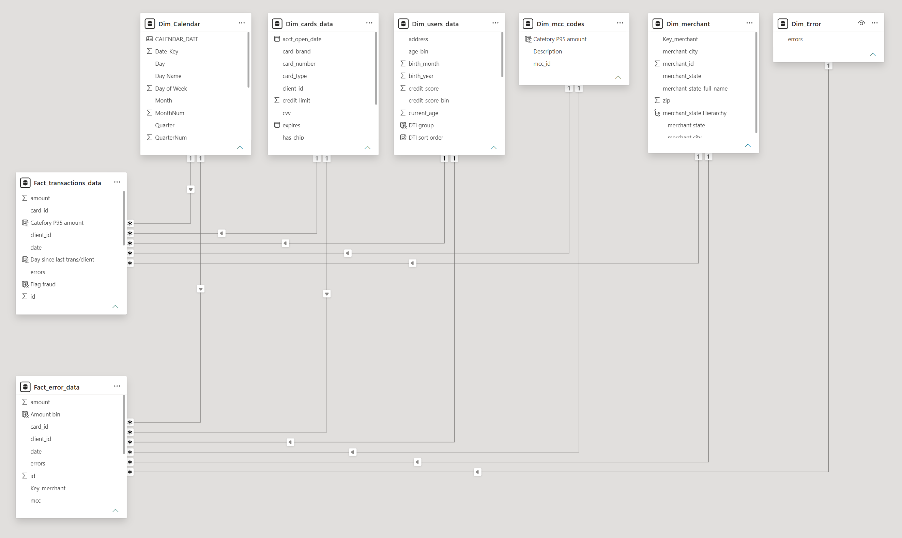
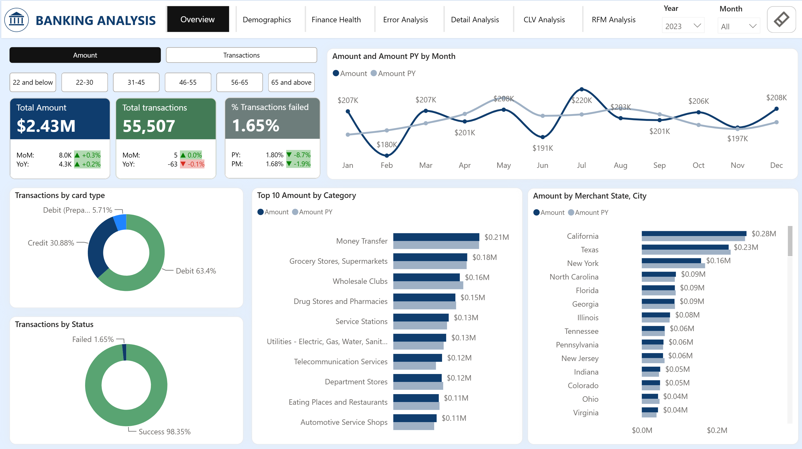
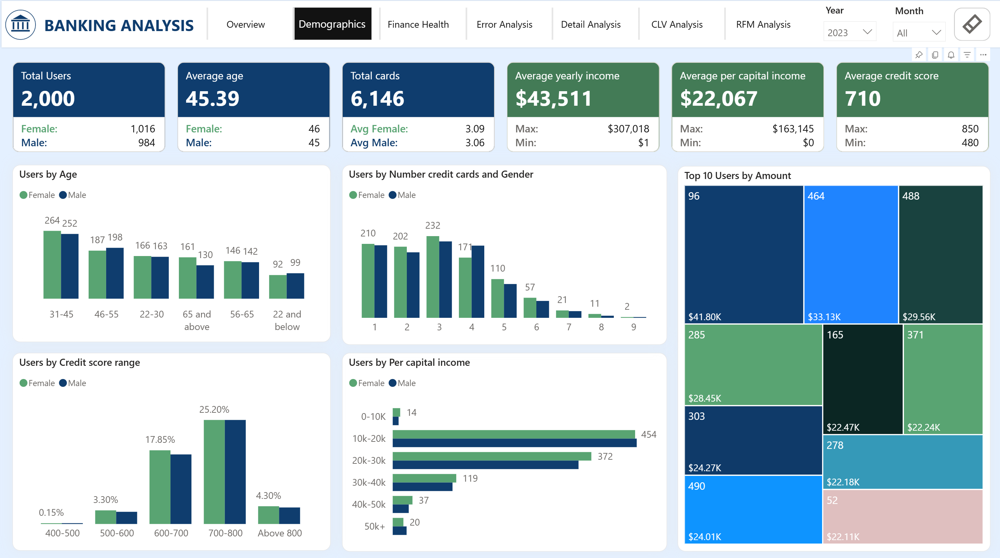
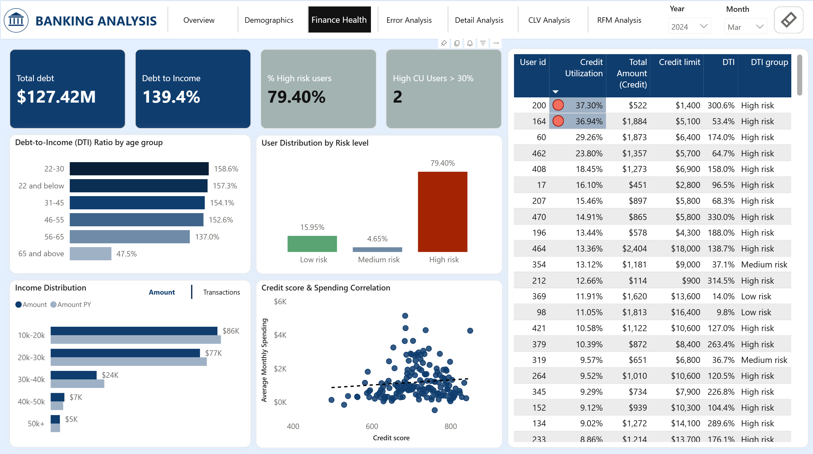
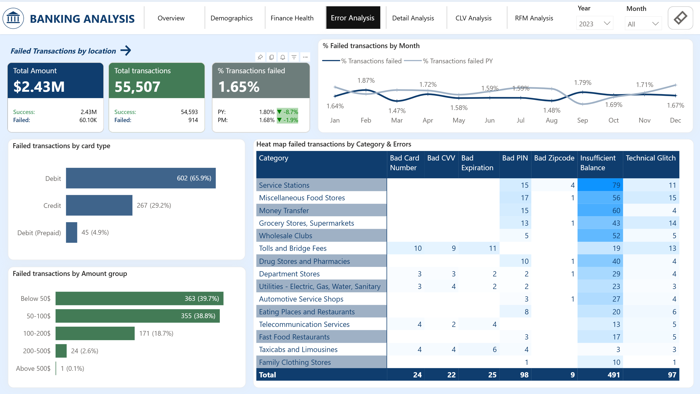
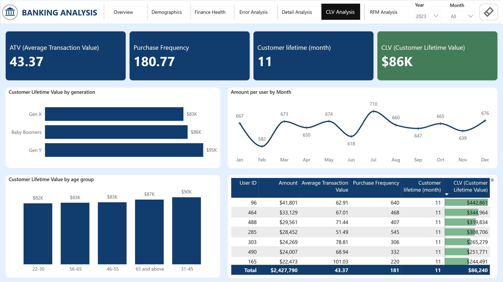
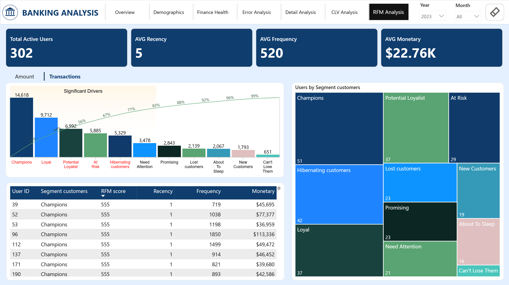

# 🏦 Aurora Bank - Customer Insights & Fraud Detection Dashboard

## 📌 Project Overview

This end-to-end Power BI project designed for the banking sector. The project focuses on transforming raw transactional and customer data into actionable insights, focusing on  **Customer Segmentation**,  **Credit Risk Analysis**,  **Fraud Detection**, and  **Customer Value Modeling (CLV)** .

---

## 🎯 Objectives

* **Analyze transaction behavior** to identify spending trends.
* **Segment customers** using behavioral characteristics and financial health.
* **Evaluate customer value** through CLV metrics across generations.
* **Risk Management:** detecting fraudulent transactions before they impact the bank's bottom line.

---

## 🛠️ Tech Stack & Skills

* **Data Source:** CSV Files (~150,000+ rows of transactional data).
* **Data Preparation:** Power Query for ETL processes, data cleaning and transformation.
* **Data Modeling:** Star Schema design with Fact and Dimension tables.
* **Analytics & Calculations:** Advanced DAX (Time intelligence, conditional formatting).
* **Data Visualization:** Power BI Desktop (Interactive dashboards, tooltips, drill-throughs).

---

## 📐 Data Structure & Data Workflow

The data model follows a **Star Schema** architecture:

* **Fact Tables:** `Fact_Transactions_data`, `Fact_error_data`
* **Dimension Tables:** `Dim_Calendar`, `Dim_cards_data`, `Dim_users_data`, `Dim_mcc_codes, Dim_merchant, Dim_error`

---

## 📊 Dashboard Key Features & Insights

### 1. Overview

* **Features:**

  * Key metrics: Total Amount, Total transactions, and % Transactions failed across different age groups.
  * Displays monthly historical trends, card type distributions, top spending categories, and regional merchant performance.
  * Helps identify key revenue-driving age segments, top spending categories, and system transaction failure rates.
* **Business Insight:**

  * **Ages 31-55:** spends the most (~$4.33M) and shops regularly. Main categories:  **Supermarkets** ,  **Service Stations** , and  **Restaurants** .
  * **Ages 22-30 :** minimal spend ($179K) and low usage, peaking only at **auto service shops/pharmacies**, and have the highest error rate (2.14%).
  * **Ages 65+:** uses their cards the most, mostly at Supermarkets. Most of these users live in California and Texas.
  * **Geography:** **California** has the highest spending (ages 65+), but **Texas** has the highest daily card swipes (ages 31-45).

### 2. Customer Demographics

* **Features:** Demographic KPIs (Total Users, Average Age, Average Yearly Income, Average Credit Score), dynamic distributions by age, gender, income levels and a Top 10 Users treemap to monitor high-value accounts.
* **Business Insight:**

  * The customer base is 31-45-year-olds with 600-800 credit scores and $10K–$30K incomes.
  * Over 1,000 users have an average credit score of 710, and those with credit scores between 700 and 800 have per capita incomes of $10K–$40K, making them prime targets for credit card upsells and credit limit increases.

### 3. Finance Health

* **Features:**

  * Focuses on credit risk and financial health assessment of bank users.
  * Tracks Financial KPIs: Total Debt, Debt-to-income, % High Risk users, High Credit Utilization Users > 30% and critical credit utilization alerts.
  * Includes deep-dive breakdowns by age groups, income distributions, and risk levels to identify segments under financial difficulties.
  * Helps detect high-risk default segments and check correlations between Credit Score and user spending behaviors.
* **Business Insight:**

  * **High Risk:** holds the most debt with a dangerously high DTI across all credit scores, though monthly spending below $2K.
  * **Medium Risk:** users show good spending habits: those with higher credit scores actually spend less, and no one goes over their credit limit.
  * **Low Risk:** displays perfect financial health and top-tier credit scores but they rarely use their cards, keeping their monthly spend under $1K.
  * Young adults (22-30) face dangerous financial risk with high DTI, while the elderly (65+) remain highly stable and safe.

### 4. Error Analysis

* **Features:**

  * Focuses on transactional errors and system failures in banking operations.
  * Tracks the number of failed transactions and % Transactions Failed between Previous Year (PY) and Previous Month (PM), breakdowns across card types, transaction amount groups, and merchant categories to identify high-failure segments.
* **Business Insight:**

  * Debit card insufficient balance errors caused about 60% of system failures over the last three years.
  * Over 80% of errors occur in low-value daily expenditure segments (under $100), while major transaction errors are rare.
  * Security errors (Bad Card, Bad CVV, Expired Card) are mostly concentrated in toll payments, requiring a root cause investigation.

### 5. Fraud Analysis & Dormant cards

* **Features:**

  * Focuses on monitoring fraudulent transactions, managing dormant account, and transactional time-pattern analysis.
  * Shows detailed data on dormant cards, top fraud categories, and how transactions change over time.
* **Business Insight:**

  * Total dormant cards stay high at over 5,200 annually, mostly coming from Mastercard and Visa.
  * Suspected fraudulent transactions showed a healthy reduction trend by 2024, falling 9.2% month on month to 2,279 cases.
  * The risk of fraud is high in everyday retail (groceries/gas stations) between 11AM to 4PM.

### 6. CLV Analysis

* **Features:**
  * Focuses on evaluating Customer Lifetime Value (CLV), purchase frequencies, and average transaction values (ATV) to monitor long-term revenue health and identify the most valuable customer segments.
* **Business Insight:**
  * Gen Y always has the highest CLV throughout the year, making them the most profitable group for the bank.
  * On average, user spending hits its highest point in summer (May and July) and drops to its lowest in February and November.

### 7. RFM Analysis

* **Features:**

  * Focuses on Recency, Frequency, and Monetary (RFM) behavioral framework to segment the customer base.
  * Provides Pareto analysis to evaluate each segment's revenue contribution.
* **Business Insight:**

  * The Recency dropped from 8 days to 3 days, meaning customers are using their cards much more often.
  * "Champions" and "Loyal" customer groups are the most important because they make the highest number of transactions.
  * A large number of customers are in the "Hibernating" and "At Risk" groups, so the bank needs to bring them back soon.

---

## 💡 Recommendations

1. Lower high-risk youth credit (DTI >150%) and enable Debit balance alerts to reduce small failures.
2. Deploy contactless payments at toll booths and boost afternoon retail fraud filters during peak hours (11AM - 4PM).
3. Launch cashback and premium rewards to boost daily spending for the low-risk and high-score segment.
4. Design exclusive loyalty programs for Gen Y and launch seasonal spending promos before the May and July peaks.
5. Send automated deals to reactivate Hibernating/At Risk users and work with card providers to close 5,200 dead cards.

---

## 👤Author

* **Name:** Nguyễn Thị Thu Giang
* **Linkedin:** [www.linkedin.com/in/giang-nguyen-368844241](https://www.linkedin.com/in/giang-nguyen-368844241/)
* **Github:** [github.com/giangntt023](https://github.com/giangntt023)

---

*Last updated: 07/2026.*
