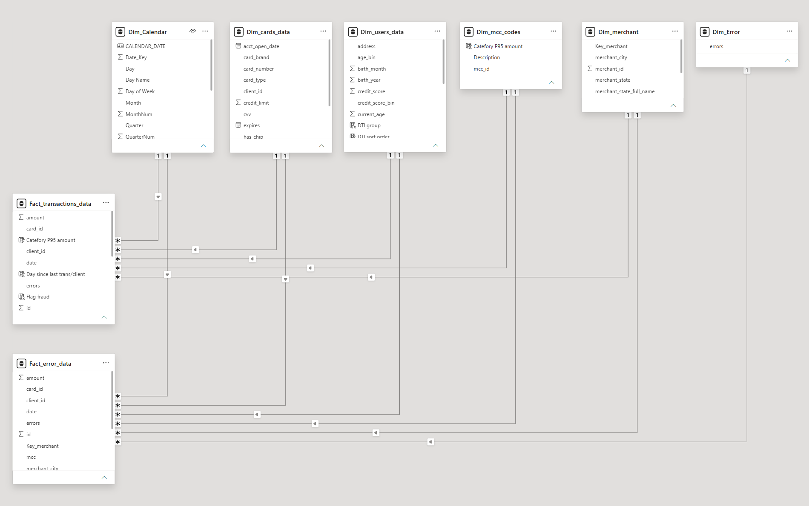
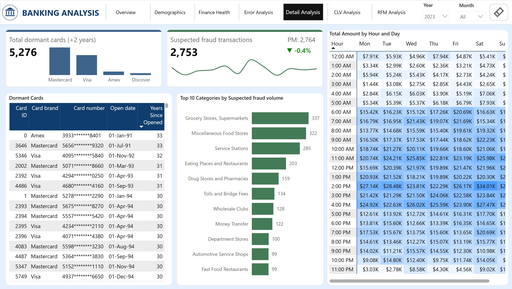

# 🏦 Aurora Bank - Customer Insights & Fraud Detection Dashboard

## 📌 Project Overview

This end-to-end Power BI project designed for the banking sector. The project focuses on transforming raw transactional and customer data into actionable insights, focusing on  **Customer Segmentation**,  **Credit Risk Analysis**,  **Fraud Detection**, and  **Customer Value Modeling (CLV)** .

---

## 🎯 Objectives

* **Analyze transaction behavior** to identify spending trends.
* **Segment customers** using behavioral characteristics and financial health.
* **Evaluate customer value** through CLV metrics across generations.
* **Risk Management:** detecting fraudulent transactions before they impact the bank's bottom line.

---

## 🛠️ Tech Stack & Skills

* **Data Source:** CSV Files (~150,000+ rows of transactional data).
* **Data Preparation:** Power Query for ETL processes, data cleaning and transformation.
* **Data Modeling:** Star Schema design with Fact and Dimension tables.
* **Analytics & Calculations:** Advanced DAX (Time intelligence, conditional formatting).
* **Data Visualization:** Power BI Desktop (Interactive dashboards, tooltips, drill-throughs).

---

## 📐 Data Structure & Data Workflow

The data model follows a **Star Schema** architecture:

* **Fact Tables:** `Fact_Transactions_data`, `Fact_error_data`
* **Dimension Tables:** `Dim_Calendar`, `Dim_cards_data`, `Dim_users_data`, `Dim_mcc_codes, Dim_merchant, Dim_error`

---

## 📊 Dashboard Key Features & Insights

### 1. Overview

* **Features:**

  * Key metrics: Total Amount, Total transactions, and % Transactions failed across different age groups.
  * Displays monthly historical trends, card type distributions, top spending categories, and regional merchant performance.
  * Helps identify core revenue-driving age segments, top-performing spending categories, and monitor system transaction failure rates.
* **Business Insight:**

  * **Ages 31-55 (Main Revenue):** this group spends the most (~$4.33M) and shops regularly. Main categories:  **Supermarkets** ,  **Service Stations** , and  **Restaurants** .
  * **Ages 22-30 (Low Activity):** this group spends very little (~$179K) and rarely uses their cards. They only spend big at **Auto Repair Shops** and  **Pharmacies** , and they have the highest transaction failure rate ( **2.14%** ).
  * **Ages 65+ (High Frequency):** this group uses their cards the most, mostly at Supermarkets. Most of these users live in California and Texas.
  * **Geography:** **California** has the highest spending (group age 65+), but **Texas** has the highest daily card swipes (group age 31-45).

### 2. Customer Demographics

* **Features:** Demographic KPIs (Total Users, Average Age, Average Yearly Income, Average Credit Score), dynamic distributions by age, gender, income levels and a Top 10 Users treemap to monitor high-value accounts.
* **Business Insight:**

  * The primary customer base is the 31-45 age group, with credit scores ranging from 600 to 800 and incomes between $10K and $30K.
  * The average credit score is relatively high at around 710 across over 1,000 users; customers with credit scores between 700 and 800 mostly have a per capital income of $10K–$40K, making them primary targets for credit card upsells and credit limit increases.

### 3. Finance Health

* **Features:**

  * Focuses on credit risk and financial health assessment of bank users.
  * Tracks Financial KPIs: Total Debt, Debt-to-income, % High Risk users, High Credit Utilization Users > 30% and critical credit utilization alerts.
  * Includes deep-dive breakdowns across age groups, income distributions, and risk levels to identify segments under financial difficulties.
  * Helps detect high-risk default segments and check correlations between Credit Score and user spending behaviors.
* **Business Insight:**

  * **High Risk:** this group holds most of the debt ($124.50M) with a very high DTI of 170.1%. It includes all types of credit scores (even up to 850). Most people here spend under $2K a month, but there are a few high spenders who reach $2K to $4K.
  * **Medium Risk:** this segment looks safe with a low debt of $1.77M and a reasonable 42.2% DTI. Users show good spending habits: those with higher credit scores actually spend less, and no one goes over their credit limit.
  * **Low Risk:** this group is in perfect financial health, with only $1.15M in debt and a very low 8.2% DTI. Even though they have great credit scores (700 to 800+), they rarely use their cards, keeping their monthly spend under $1K.
  * The 22-30 age group has a high financial risk with a DTI of approximately 158.6%, while the 65+ age group has a stable financial status with a significant DTI of 47.5%.

### 4. Error Analysis

* **Features:**

  * Focuses on transactional errors and system failures in banking operations.
  * Tracks the number of failed transactions and % Transactions Failed between Previous Year (PY) and Previous Month (PM), breakdowns across card types, transaction amount groups, and merchant categories to identify high-failure segments.
* **Business Insight:**

  * Debit cards and insufficient balance errors are consistently the core cause of system failures, accounting for over 55% of all errors over the past three years.
  * Over 80% of errors are concentrated in low-value daily spending segments (under $100), while errors in large transactions are very rare.
  * The high number of security errors (Bad Card, Bad CVV) at toll booths may be due to card verification fraud, drivers attempting to bypass barriers with expired cards, or employees entering incorrect card numbers in a rush.

### 5. Fraud Analysis & Dormant cards

* **Features:**

  * Focuses on monitoring fraudulent transactions, managing dormant account, and transactional time-pattern analysis.
  * Shows detailed data on dormant cards, top fraud categories, and how transactions change over time.
* **Business Insight:**

  * Total dormant cards stay high at over 5,200 annually, mostly coming from Mastercard and Visa.
  * Suspected fraudulent transactions showed a healthy downward trend by 2024, decreasing by 9.2% month-over-month to 2,279 cases.
  * Fraud mostly happens in everyday shopping places like food stores and service stations, especially during the afternoon from 11:00 AM to 4:00 PM.

### 6. CLV Analysis

* **Features:**
  * Focuses on evaluating Customer Lifetime Value (CLV), purchase frequencies, and average transaction values (ATV) to monitor long-term revenue health and identify the most valuable customer segments.
* **Business Insight:**
  * Gen Y always has the highest CLV throughout the year, making them the most profitable group for the bank.
  * On average, user spending hits its highest point in summer (May and July) and drops to its lowest in February and November.

### 7. RFM Analysis

* **Features:**

  * Focuses on Recency, Frequency, and Monetary (RFM) behavioral framework to segment the customer base.
  * Provides Pareto analysis to evaluate each segment's revenue contribution.
* **Business Insight:**

  * The Recency dropped from 8 days to 3 days, meaning customers are using their cards much more often.
  * "Champions" and "Loyal" customer groups are the most important because they make the highest number of transactions.
  * A large number of customers are in the "Hibernating" and "At Risk" groups, so the bank needs to bring them back soon.

---

## 💡 Recommendations

1. Lower credit limits for high-risk young users (DTI >150%) and add low-balance alerts on Debit cards to reduce small-transaction failures.
2. Implement contactless payments at toll booths and increase fraud-detection filters in the retail sector during peak afternoon hours (11 AM - 4 PM).
3. Launch cashback and premium rewards to stimulate daily spending for the Low-Risk segment (credit scores 700-800+) who currently spend under $1K.
4. Design exclusive loyalty programs tailored for Gen Y (highest CLV) and create seasonal spending prompts before peak months (May and July).
5. Send automated deals to bring back "Hibernating" or "At Risk" users, and work with Visa/Mastercard to close down the 5,200 dead cards.

---

## 👤Author

* Name: Nguyễn Thị Thu Giang
* Linkedin: [www.linkedin.com/in/giang-nguyen-368844241](https://www.linkedin.com/in/giang-nguyen-368844241/)
* Github: [github.com/giangntt023](https://github.com/giangntt023)

---

*Last updated: 07/2026.*
